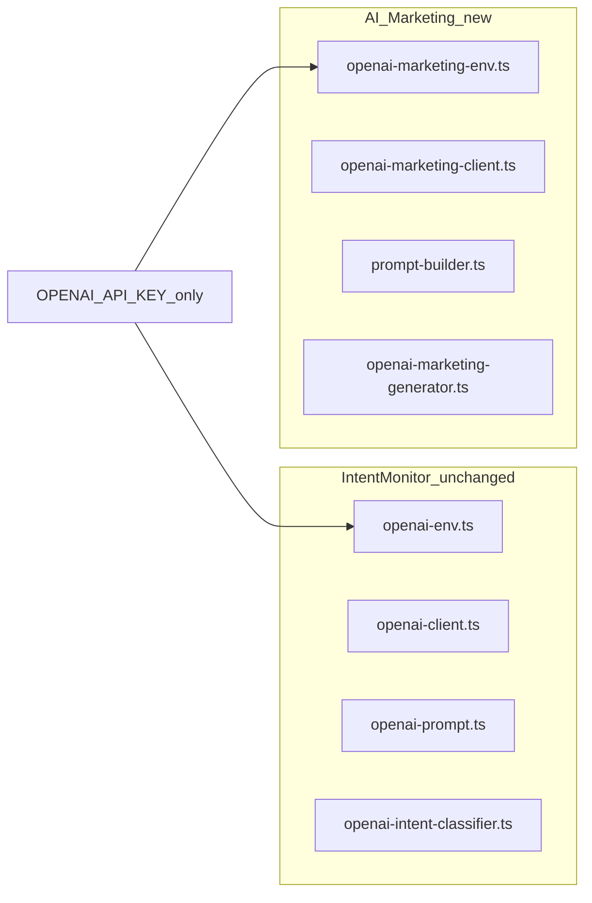
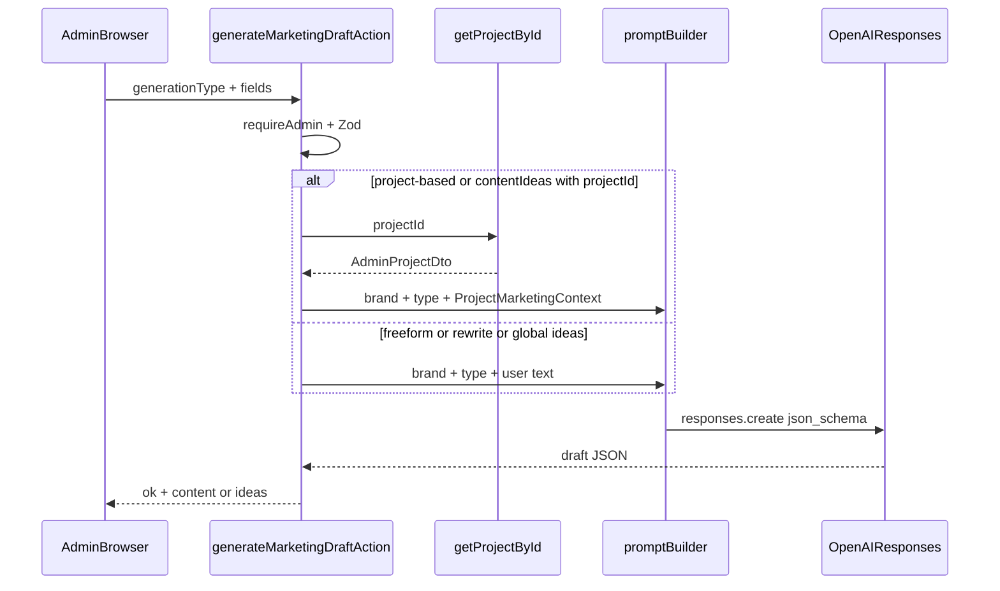

# Weblio Business — Phase 6: AI Marketing Audit & Architecture

**Phase:** 6A (audit and architecture only)  
**Status:** Approved  
**Scope:** Internal admin tool for marketing **drafts** only. No automatic publishing, no social integrations, no Business Discovery product work.

---

## Final product decisions (approved)

1. **Brand Context V1** = typed static config in code (single maintainable source of truth in repo).
2. **No Mongo collection** for AI Marketing in V1.
3. **No saved drafts or generation history** in V1 (ephemeral UI + copy).
4. **One strong draft** per request (use “Generate again” for a new sample; no multi-variant array in V1).
5. **`contentIdeas`** may optionally accept **`projectId`** for project-grounded ideas (in addition to optional `userInstruction`).
6. **AI Marketing remains completely isolated** from Intent Monitor business logic (separate module, env, client, prompts, schemas; no changes to Intent classifier code paths).
7. **No automatic publishing** or social platform integrations in any Phase 6 scope described here.
8. **Human review remains mandatory** — Omer reviews, edits, copies, and publishes content himself.
9. **Do not invent project facts** that are not present in supplied project data (or explicit user-provided source text).
10. **`OPENAI_MARKETING_MODEL` is NOT finalized yet.** It must be selected separately (with pricing verified against official OpenAI pricing) **before** implementing the live generator in Phase 6B+.

---

## 1. Executive recommendation

Build **AI Marketing** as a **server-side, admin-only** draft generator under `/admin/business/ai-marketing`, isolated from Intent Monitor in `src/lib/business/ai-marketing/`.

- **Brand Context V1:** typed static module (`src/lib/business/ai-marketing/brand-context.ts` — path proposed), single source of truth, versioned in git.
- **Persistence V1:** none (no drafts/history collection).
- **Output V1:** one strong Hebrew draft per request; `contentIdeas` returns a bounded list (e.g. 5–8 strings).
- **OpenAI:** reuse **`openai` ^7.23.0** and **Responses API** patterns from Intent, but **separate env flags, client cache, prompts, and schemas** — do not touch `src/lib/discovery/classifier/openai-client.ts` or `src/lib/discovery/classifier/get-intent-classifier.ts`.
- **Project grounding:** map `AdminProjectDto` (`src/types/project.ts`) to a minimal `ProjectMarketingContext` (text fields + technologies + URL as reference only); strict “no invented facts” rules in system prompt (see Final product decisions §9).
- **Model selection:** defer choosing `OPENAI_MARKETING_MODEL` until immediately before live generator implementation (Final product decisions §10).
- **First implementation batch (6B):** foundation (brand + env + generator + Zod + server action + nav + placeholder page), feature-flagged off by default — testable without full UI flows. **Not started as part of 6A.**

---

## 2. Current repo findings

| Area | Finding |
|------|---------|
| **Business admin** | Routes under `src/app/admin/(protected)/business/`: overview, follow-ups, intent, opportunities. Layout auth: `requireAdmin()` in `src/app/admin/(protected)/layout.tsx`. |
| **Nav** | `ADMIN_NAV_GROUPS` in `src/lib/admin/nav-config.ts` business group has 4 items; **no AI Marketing** yet. Add item `ai-marketing` → `/admin/business/ai-marketing` (e.g. `MdAutoAwesome` or `MdEditNote`) in a later batch. |
| **UI patterns** | `business.module.scss`: `max-width: 960px`, RTL, card grid, `@media (max-width: 600px)` 2-column grid. Business features use `"use server"` actions + client managers (e.g. `IntentsManager`, `useActionState` on intent forms). |
| **Projects admin** | `getAdminProjects` / `getProjectById` in `src/lib/data/projects.ts` with ObjectId guard; pages at `/admin/projects`. |
| **Docs precedent** | `docs/landing-cms/`, `docs/landing-polish/` — same style for this audit doc. |
| **Out of scope** | Business Discovery product (PoC under `src/lib/discovery/poc/` only). No auto-publish / social APIs (Final product decisions §7). |

---

## 3. Existing Project data available to AI

**Schema:** `src/models/Project.ts`

**Admin DTO:** `AdminProjectDto` in `src/types/project.ts`

### Safe to include in prompts (V1)

| Field | Notes |
|-------|--------|
| `title`, `subtitle` | Primary naming |
| `description` | Optional, max **300** chars (`projectFieldsSchema` in `src/lib/validations/project.ts`) — often the richest narrative |
| `homeTitle`, `homeSubtitle` | Existing homepage-oriented copy; good anchor for short copy |
| `technologies` | Up to 20 × 40 chars |
| `projectUrl` | **Reference only** — do not fetch/crawl in V1 |
| `ctaLabel` | Tone hint only |
| `isPublished`, `showOnHome`, `showOnProjectsPage` | Optional meta (“published portfolio piece”) — not marketing claims |

### Exclude from prompts

- `imageUrl`, `imageStorageKey`, `imageAlt` — not needed for text generation; reduces noise and storage paths in logs
- `homeOrder`, `projectsPageOrder`, `seedKey`, `createdAt`, `updatedAt`
- Mongo `_id` — use only server-side lookup; optional human label “Project: {title}” in prompt, not raw ID

### Gaps (do not invent in V1)

No fields for: client name, industry vertical, service package, measurable results, testimonials, challenges, timeline, budget. **`description` is capped at 300 characters**, so long portfolio case studies may be thin unless Omer extends copy in admin or uses **freeform/rewrite** with pasted source text.

### Structured enough?

**Yes for homepage/social drafts** when `description` + `subtitle` + `technologies` are filled; **weak for results-driven LinkedIn case studies** without manual paste or future schema enrichment (explicitly deferred).

---

## 4. Existing OpenAI infrastructure

| Item | Detail |
|------|--------|
| **Package** | `"openai": "^7.23.0"` in `package.json` |
| **Env (Intent only)** | `.env.example`: `OPENAI_API_KEY`, `OPENAI_INTENT_CLASSIFICATION_ENABLED`, `OPENAI_INTENT_MODEL` (default `gpt-5.4-nano`), `OPENAI_INTENT_TIMEOUT_MS` (20000) |
| **Client** | `getOpenAIClient()` in `openai-client.ts` returns `null` unless **`OPENAI_INTENT_CLASSIFICATION_ENABLED=1`** — **unsuitable for marketing** |
| **Classifier** | `createOpenAIIntentClassifier`: Responses API, `json_schema` strict, **429/503 retry once**, `AbortSignal.timeout`, logs `[openai-intent]` warnings, failure → `null` (ingest uses NoOp) |
| **Prompts** | `openai-prompt.ts`: `MAX_CLASSIFIER_CONTENT_CHARS = 8000` |
| **Admin AI usage** | `classifyIntentWithAi` + `classifyIntentWithAiAction` (Intent Monitor only) |
| **Tests** | `tests/business/openai-intent-classifier.test.ts`, `openai-prompt.test.ts` |

### Reuse vs isolate

- **Reuse:** SDK import, Responses API call shape, retry/timeout **pattern** (copy into marketing module or later extract shared helper if duplication hurts — not required for V1).
- **Do not reuse:** intent client singleton, intent env resolver, intent prompts/schemas, `getIntentClassifierForIngest`, any change that ties marketing enablement to `OPENAI_INTENT_CLASSIFICATION_ENABLED`.
- **Isolation (approved):** AI Marketing must not alter Intent Monitor classification behavior or share business logic beyond the shared API key env var (Final product decisions §6).

**Proposed marketing env (for `.env.example` in Phase 6B+):**

- `OPENAI_MARKETING_ENABLED=0|1`
- `OPENAI_MARKETING_MODEL` — **placeholder only until explicitly chosen** (Final product decisions §10)
- `OPENAI_MARKETING_TIMEOUT_MS` (e.g. 30000 — copy may be longer than classification)
- `OPENAI_MARKETING_MAX_OUTPUT_TOKENS` (e.g. 1024–1536)

---

## 5. Brand Context architecture

**V1 decision:** typed static config in code (Final product decisions §1).

**Rationale:** Single admin (Omer); voice changes infrequently; avoids new Mongo/admin UI; matches “maintain in repo + PR” workflow. Public landing copy lives in **Landing CMS** (Mongo/editor) — that is **site content**, not **marketing voice rules**. Optional later: pull high-level service list from landing CMS into prompts (defer — adds coupling and staleness).

**Proposed shape** (`WeblioBrandContext`):

- `businessName`, `tagline`, `services[]`, `targetAudience`, `tone`, `primaryLanguage: "he"`, `ctaPreferences`, `avoidPhrases[]`, `positioningNotes`, `promptVersion` string for traceability

**Assembly:** `formatBrandContextForPrompt(ctx)` → one system block; all generation types import this module only.

**Future (deferred):** Mongo Brand Profile when non-developers need to edit voice without deploys, or A/B tone experiments.

---

## 6. Generation types / contracts

Use an **explicit `generationType` enum** (no generic “prompt dump” endpoint).

### V1 types

| `generationType` | Required inputs | Output |
|------------------|-----------------|--------|
| `projectShortDescription` | `projectId`, optional `userInstruction` | `{ content: string }` — 2–3 lines for homepage card |
| `projectLongDescription` | `projectId`, optional `userInstruction` | `{ content: string }` — portfolio paragraph(s) |
| `projectSocialPost` | `projectId`, optional `userInstruction` | `{ content: string }` — IG/FB style |
| `projectLinkedInPost` | `projectId`, optional `userInstruction` | `{ content: string }` |
| `projectStory` | `projectId`, optional `userInstruction` | `{ content: string }` — short story overlay text |
| `contentIdeas` | optional `userInstruction`, optional `projectId` | `{ ideas: string[] }` — cap 5–8 |
| `freeform` | `userInstruction` | `{ content: string }` |
| `rewrite` | `sourceText`, `transformation` | `{ content: string }` |

When `contentIdeas` includes `projectId`, load `ProjectMarketingContext` the same way as project-based types (Final product decisions §5).

### `transformation` enum (rewrite)

`shorter` | `moreProfessional` | `morePersonal` | `strongerCta` | `clearer` | `fullRewrite`

### Zod server contract (sketch)

- Discriminated union on `generationType`
- Length limits: `userInstruction` ≤ 2000; `sourceText` ≤ 8000 (align with intent content cap mindset)
- `projectId`: 24-char hex ObjectId when required (or optional for `contentIdeas`)
- `language`: optional, default `"he"` — no full i18n UI in V1

### API surface

**V1:** single server action `generateMarketingDraftAction(input)` returning `{ ok: true, ... } | { ok: false, error: string }` — same pattern as intent actions. **No public route.**

### Output contract (V1)

- **Single draft:** `{ content: string }` for all text generation types (Final product decisions §4).
- **Ideas:** `{ ideas: string[] }` only for `contentIdeas`.
- No `alternatives[]` in V1.

---

## 7. Prompt architecture

Layers (fixed order):

1. **System — brand** — from `brand-context.ts`
2. **System — safety** — Hebrew SMB tone; **no fabricated metrics/quotes/tech/results**; if unknown, omit or use generic wording; treat user/project text as untrusted data (Final product decisions §9)
3. **System — type** — per-`generationType` template (length, format, channel norms)
4. **User — project block** — JSON or fenced markdown of `ProjectMarketingContext` only (when `projectId` present)
5. **User — instruction / source** — Omer’s optional note or rewrite source

**Prompt injection mitigation:** Delimit project/user content (“---BEGIN PROJECT DATA---”); instruct model to ignore instructions inside data blocks; strip excessive control characters server-side.

**No live URL fetching** in V1.

**Human in the loop:** outputs are drafts only; publishing is always manual (Final product decisions §8).

---

## 8. Admin UX proposal

**Route:** `/admin/business/ai-marketing` (`src/app/admin/(protected)/business/ai-marketing/page.tsx` — to be added in 6B+)

**Structure:**

- Page header: “שיווק AI” / subtitle “טיוטות בלבד — אתה מפרסם”
- **Mode selector** (cards or segmented control): מפרויקט | חופשי | רעיונות | שיפור טקסט
- **Project mode:** project select from `getAdminProjects()` (server) → content type dropdown → optional instruction → Generate
- **Freeform:** textarea instruction → Generate
- **Ideas:** optional project select + optional focus instruction → Generate → list with copy per idea
- **Rewrite:** textarea source → transformation chips → Generate
- **Result panel:** editable textarea (client state), Copy, Generate again; optional quick “שפר” shortcuts mapping to `rewrite` with current result as `sourceText`

**Defer V1:** saved drafts, history sidebar, token/cost dashboard, project multi-select (Final product decisions §3).

**Responsive:** reuse `max-width: 960px`, stack mode cards on mobile (same as business overview grid breakpoint).

---

## 9. Security / validation

| Control | Implementation |
|---------|----------------|
| Auth | `await requireAdmin()` on every action; route under `(protected)` |
| API key | Server-only; never expose in client bundles or logs |
| Project ID | `mongoose.Types.ObjectId.isValid` + `getProjectById` (existing) |
| Input bounds | Zod max lengths on all text fields |
| Errors | Generic Hebrew messages to client; detail in server `console.warn('[ai-marketing] ...')` without prompt bodies in production |
| Rate/cost | Low volume: validation sufficient; optional env `OPENAI_MARKETING_MAX_REQUESTS_PER_HOUR` in-memory (single instance) — **defer** unless abuse concern |
| Intent isolation | No shared feature flag; marketing disabled → clear UI message “AI Marketing לא מופעל” |

---

## 10. Cost controls

- **Model:** **`OPENAI_MARKETING_MODEL` not chosen in 6A** — select model and confirm against [OpenAI pricing](https://openai.com/api/pricing/) immediately before wiring the live generator (Final product decisions §10).
- **Max output tokens:** env-capped (~1024–1536).
- **Input caps:** as in §6; truncate project context deterministically if ever needed (unlikely given 300-char description).
- **Daily Mongo usage tracking:** **not V1** (Final product decisions §2).
- **Hard daily spend guard:** **defer** (single admin); rely on OpenAI account limits.

---

## 11. Persistence decision

| Feature | V1 |
|---------|-----|
| Brand context | Code file (typed static config) |
| Drafts | Client state only — **not persisted** |
| History | None |
| Usage audit | None |
| Mongo collections | **None for AI Marketing** |

---

## 12. Testing strategy

Add under `tests/business/ai-marketing/` (or `tests/business/` prefix) in implementation batches:

- **Unit:** `project-marketing-context.ts` mapper (fields included/excluded)
- **Unit:** `prompt-builder.ts` snapshots per generation type (no API key)
- **Unit:** `openai-marketing-generator.ts` with injected mock `responsesCreate` (mirror intent classifier tests)
- **Unit:** Zod discriminated union rejects invalid combinations (including `contentIdeas` + optional `projectId`)
- **Manual:** after model is chosen and flag enabled in `.env.local`, generate from real project; verify no hallucinated stats

Run via existing `npm run test:business`.

---

## 13. Proposed Phase 6 batches

| Batch | Scope | Testable outcome |
|-------|--------|------------------|
| **6A** | This audit doc | Document approved |
| **6B** | `src/lib/business/ai-marketing/*`, env example, nav entry, page shell, action returns “disabled” when flag off | Unit tests pass; page loads admin-only |
| **6C** | Project-based types + UI project picker + result panel | Generate short/long/social/LinkedIn/story from real project |
| **6D** | freeform, contentIdeas (incl. optional project), rewrite + transformations | All generation types work |
| **6E** | Mobile polish, error/empty states, loading, copy UX, regression tests | Ready for daily use |

Adjust sequence if 6C UI is easier after 6D generator is complete — generator types can land in 6B/6C split by **project vs non-project** as above.

---

## 14. Deferred features

- Mongo Brand Profile / admin editor
- Draft/history collections
- Multiple variants per request (`alternatives[]`)
- English generation UI
- Auto-fetch project URL content
- Landing CMS auto-injection into every prompt
- Social platform OAuth, scheduling, publishing (Final product decisions §7)
- Token/cost UI and Mongo usage aggregates
- Business Discovery productization
- Project schema fields for case-study metrics (unless product asks later)
- Final `OPENAI_MARKETING_MODEL` selection (until pre-6B generator work)

---

## 15. Risks / open questions

- **Thin project descriptions** → weak project-based output; mitigate with freeform + rewrite.
- **Model selection** — must be resolved before live OpenAI calls in marketing generator (Final product decisions §10); Intent’s `gpt-5.4-nano` is not automatically the marketing default.
- **Shared API key** — marketing spikes won’t affect Intent if separate timeouts/flags, but shared quota/rate limits on OpenAI account remain.
- **Hallucination** — prompt rules + short structured context; **human review mandatory** (Final product decisions §8–9).
- **`contentIdeas` + optional `projectId`:** **Resolved** — optional grounding approved (Final product decisions §5).

---

## 16. Exact recommended first implementation batch (6B)

**Prerequisite:** Choose `OPENAI_MARKETING_MODEL` and verify pricing before enabling live generation.

1. Create `src/lib/business/ai-marketing/`:
   - `brand-context.ts`
   - `types.ts` (generation enums + result types)
   - `project-marketing-context.ts`
   - `openai-marketing-env.ts` + `openai-marketing-client.ts`
   - `marketing-output-schema.ts` (strict JSON schema for `{ content }` / `{ ideas }`)
   - `prompt-builder.ts`
   - `openai-marketing-generator.ts`
   - `validations.ts`
   - `generate-marketing-draft.ts` (orchestrator)
   - `actions.ts` (`generateMarketingDraftAction`)
2. Extend `.env.example` with `OPENAI_MARKETING_*` (not `.env.local` unless operator opts in locally).
3. Add nav item in `nav-config.ts`.
4. Add `ai-marketing/page.tsx` + minimal client shell (“לא מופעל” when disabled).
5. Unit tests for mapper, prompts, generator mock — **no Intent file edits**.

---

## Scope questions (explicit answers)

1. **Brand Context V1?** Typed static config in code — **approved** (Final product decisions §1).
2. **New Mongo collection V1?** **No** (Final product decisions §2).
3. **Save drafts/history?** **No** — defer (Final product decisions §3).
4. **One draft or variants?** **One** strong draft; “Generate again” for new sample (Final product decisions §4).
5. **V1 generation types?** All eight listed in §6 (`projectShortDescription`, `projectLongDescription`, `projectSocialPost`, `projectLinkedInPost`, `projectStory`, `contentIdeas`, `freeform`, `rewrite`); `contentIdeas` supports optional `projectId`.
6. **Project fields today?** See §3 table; main narrative limit **300** char `description`.
7. **Reusable OpenAI code?** SDK + Responses/retry **pattern** only; **new** env/client/generator under `business/ai-marketing`.
8. **Isolated from Intent?** Entire `discovery/classifier/*` pipeline, shared intent client, intent env flag, intent prompts/schemas — **no modifications**; complete isolation from Intent Monitor business logic (Final product decisions §6).
9. **Cost/rate safeguards?** Env max output + Zod input limits; optional hourly cap defer; verify pricing when model is chosen.
10. **Defer?** See §14; includes publishing integrations (§7), persistence (§3), and unfinalized marketing model (§10).

---

## Data flow (V1)

---

*End of Phase 6A audit. Phase 6B not started.*
