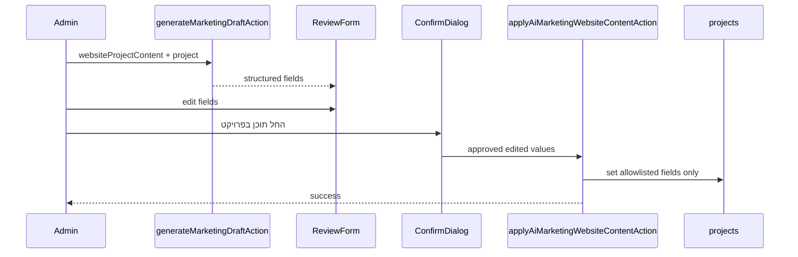
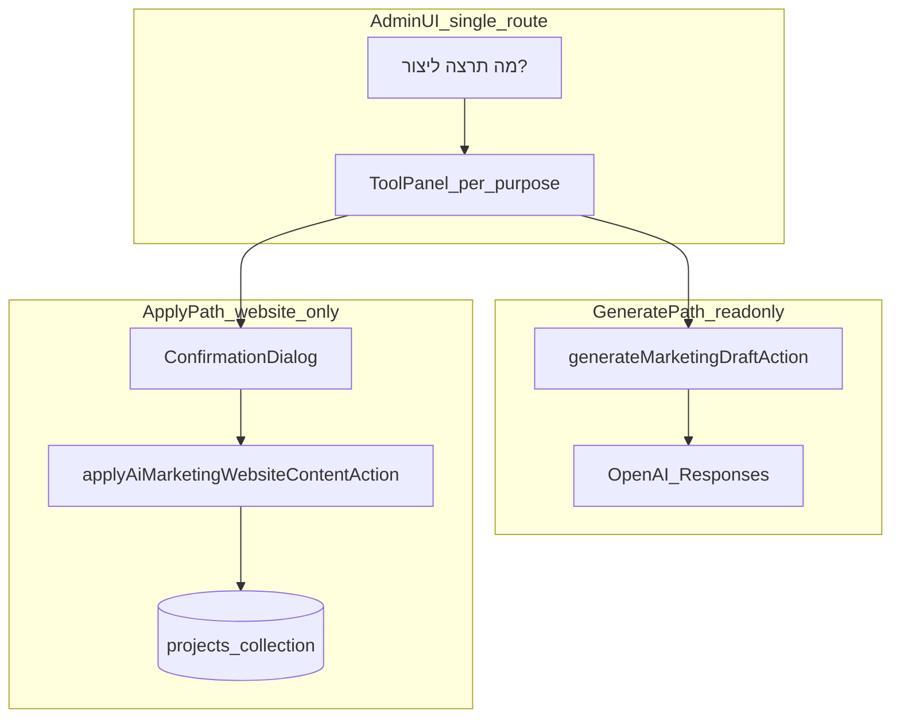

# Weblio Business — Phase 6C.1: AI Marketing UX & Content Architecture Audit

**Phase:** 6C.1 (audit and architecture only)  
**Status:** Approved  
**Prerequisite docs:** [webliobusiness-phase6-ai-marketing-audit.md](./webliobusiness-phase6-ai-marketing-audit.md)  
**Scope:** Redesign product architecture before Phase 6C.2+. No implementation in this phase.

---

## Approved final product decisions

The following decisions are **approved** for implementation batches 6C.2 onward:

| Decision | Approved choice |
|----------|-----------------|
| Generation model | **`purpose` + `source`** (not admin-facing technical enums) |
| Routing | **Single route** `/admin/business/ai-marketing` with client-side tool selection |
| `projectLongDescription` | **Removed from V1** user-facing product and generation contract |
| Website Content output | **Structured JSON** (multi-field), not a single text blob |
| Website Content apply fields | **`title`, `subtitle`, `description`, `homeTitle`, `homeSubtitle` only** |
| Technologies / tags | **Deterministic** from existing Project — **not** AI-generated or applied in V1 |
| Generate vs apply | **Separate paths** — generation is read-only; apply is a distinct action |
| Project mutation | **Explicit confirmation dialog** before any Project write |
| Social Post sources | **Project + free topic** |
| LinkedIn Post sources | **Project + free topic** |
| Story sources | **Project + free topic** |
| Story format V1 | **One text block** `{ content }` — not structured slides |
| Content Ideas sources | **Global Weblio + optional project** |
| Improve Text | **Optional custom instruction** allowed |
| AI Marketing Mongo | **No new collection** — only optional write to existing `projects` via apply |
| Brand voice | Preserve Phase 6C refinement (first-person singular, anti-cliché, no invented facts) |

---

## 1. Executive recommendation

AI Marketing should answer **“מה תרצה ליצור?”** with **purpose-based tools**, not a single “project-based generation” workspace keyed to internal types like `projectShortDescription`.

**Architectural shift:**

- **User-facing:** seven tools (תוכן לאתר, פוסט לרשתות, פוסט LinkedIn, סטורי, רעיונות לתוכן, שיפור טקסט, כתיבה חופשית).
- **Internal contract:** `purpose` + `source` instead of multiplying enums (`projectSocialPost` vs hypothetical `freeformSocialPost`).
- **Website tool:** generate **structured website copy** → review/edit in a multi-field form → **apply to Project** only after confirmation via a **narrow, allowlisted** server action.
- **All other tools:** generate → edit locally → copy/regenerate; **no Project apply**.

**Remove `projectLongDescription` from V1:** the public site has no separate “long portfolio body” field; `description` is capped at **300** characters in [`projectFieldsSchema`](weblio/src/lib/validations/project.ts).

**Keep unchanged from Phase 6A/6B:** drafts not persisted in Mongo; OpenAI isolated from Intent Monitor; human review mandatory; no auto-publish.

**Recommended implementation batches:**

| Batch | Focus |
|-------|--------|
| **6C.2** | Purpose hub UI shell + `purpose`/`source` contract (+ temporary adapter from legacy enums) |
| **6C.3** | Website Project Content: structured output, review form, confirm, `applyAiMarketingWebsiteContentAction` |
| **6D** | Social, LinkedIn, Story (project + free topic), Content Ideas, Improve Text, Free writing |
| **6E** | Polish, thin-project notices, regression tests |

**Phase 6C.2 not started until explicit approval after this document.**

---

## 2. Problems found in current Phase 6C UX/model

Manual testing confirmed generation works, but the **product model** mismatches how Omer works.

| Problem | Repo evidence |
|---------|----------------|
| UX organized by **technical source** (“תוכן מפרויקט”) not **goal** | [`AiMarketingProjectWorkspace.tsx`](../src/components/admin/business/ai-marketing/AiMarketingProjectWorkspace.tsx) |
| Five **internal generation types** exposed as content-type cards | [`project-generation-ui.ts`](../src/lib/business/ai-marketing/project-generation-ui.ts) → `projectShortDescription`, `projectLongDescription`, etc. |
| **No apply-to-Project** — copy → Projects → Edit → paste | Only [`generateMarketingDraftAction`](../src/lib/business/ai-marketing/actions.ts) |
| **`projectShortDescription`** returns one `{ content }` string | Does not match [`ProjectForm.tsx`](../src/components/admin/projects/ProjectForm.tsx) multi-field copy |
| **`projectLongDescription`** lacks a distinct public destination | Featured uses `description` (max 300); projects list shows title/subtitle only — [`Projects.tsx`](../src/views/projects/Projects.tsx) |
| Social/LinkedIn/Story **require `projectId`** today | [`validations.ts`](../src/lib/business/ai-marketing/validations.ts) |
| Voice refinement helped, but **purpose-specific prompts** still bundled under generic project types | [`prompt-builder.ts`](../src/lib/business/ai-marketing/prompt-builder.ts) |

---

## 3. Actual Project fields and public destinations

**Schema:** [`src/models/Project.ts`](../src/models/Project.ts)  
**Admin DTO:** [`src/types/project.ts`](../src/types/project.ts)  
**Admin form:** [`ProjectForm.tsx`](../src/components/admin/projects/ProjectForm.tsx)  
**Public mapping:** [`mapToPublicProjectDto` / `mapToHomePublicProjectDto`](../src/lib/projects/rules.ts)

| Field | Admin label (Hebrew) | Max length (Zod) | Public destination |
|-------|----------------------|------------------|-------------------|
| `title` | כותרת | 120 | Projects page card title; home fallback title |
| `subtitle` | תת-כותרת | 200 | Projects page + featured; home fallback subtitle |
| `description` | תיאור קצר | 300 | Featured showcase body ([`FeaturedProjectsShowcase.tsx`](../src/components/projects/FeaturedProjectsShowcase.tsx)) |
| `homeTitle` | כותרת לדף הבית (אופציונלי) | 120 | Home featured: overrides `title` |
| `homeSubtitle` | תת-כותרת לדף הבית (אופציונלי) | 200 | Home featured: overrides `subtitle` |
| `technologies` | טכנולוגיות | 20 × 40 chars | Featured showcase chips only |
| `projectUrl`, `ctaLabel`, `image`, publish flags, orders | Various | — | **Not** website copy for AI Marketing apply |

**Projects list page** ([`views/projects/Projects.tsx`](../src/views/projects/Projects.tsx)): displays **`title`**, **`subtitle`**, CTA, image — **not** `description` or `technologies`.

**Implication:** “תוכן לאתר” should target the **five copy fields** above; technologies are **display/context only**, not AI output for apply.

### Project data limitations (thin projects)

When a Project has little or no `description` / `subtitle`:

- Generation may still propose copy from **existing** title, technologies, optional Omer instruction.
- Prompts must **not fabricate** missing facts (existing safeguards).
- **UX recommendation:** non-blocking notice, e.g.  
  *“מידע מוגבל על הפרויקט — הטיוטה מבוססת על מה שקיים; ודא שאין עובדות שלא סיפקת.”*

---

## 4. Website Project Content design (“תוכן לאתר”)

**Purpose:** content that will **actually be used** on Weblio’s Project presentation (homepage featured + projects surfaces).

**Requires:** select existing Project.

**Generate:**

- Dedicated **`websiteProjectContent`** purpose (replaces user-facing `projectShortDescription` / `projectLongDescription`).
- **Structured output** (see §13–14).
- **Technologies:** show current Project tags **read-only** in UI; **exclude from AI output schema and from apply payload**.

**Review:**

- Multi-field editor aligned with admin semantics (title, subtitle, description, home title/subtitle).
- All fields editable locally before apply.

**Apply (separate step):**

- Button: **“החל תוכן בפרויקט”** → confirmation (§5) → server apply → success + **“פתח את הפרויקט”** → `/admin/projects/[id]`.

**Flow diagram:**



---

## 5. Safe Project apply / write-back architecture

**Do not reuse** [`updateProjectAction`](../src/lib/projects/actions.ts):

- Expects full `FormData`, image upload, publish toggles, home featured limits.
- Would grant AI Marketing an uncontrolled “edit whole project” surface if reused loosely.

**Recommended design:**

| Layer | Responsibility |
|-------|----------------|
| **`applyAiMarketingWebsiteContentAction`** | `requireAdmin`, parse Zod, call data helper, revalidate, return Hebrew errors |
| **`updateProjectWebsiteContentFields(projectId, fields)`** in [`lib/data/projects.ts`](../src/lib/data/projects.ts) | `findByIdAndUpdate` with **`$set` allowlist only** |
| **`applyWebsiteProjectContentSchema`** | Subset of [`projectFieldsSchema`](../src/lib/validations/project.ts): `title`, `subtitle`, `description`, `homeTitle`, `homeSubtitle` |

**Allowlisted writable fields (approved):**

- `title`
- `subtitle`
- `description`
- `homeTitle`
- `homeSubtitle`

**Forbidden on apply (must not appear in update object):**

- `technologies`, `image`, `projectUrl`, `ctaLabel`, `isPublished`, `showOnHome`, `showOnProjectsPage`, `homeOrder`, `projectsPageOrder`, `seedKey`

**Revalidation:** mirror [`revalidateProjectPaths()`](../src/lib/projects/actions.ts): `/`, `/projects`, `/admin/projects` (and optionally `/admin/projects/[id]`).

**Trust model:** persist **client-submitted edited form values** after confirmation — re-validate on server; do not trust a hidden “original AI response” blob.

**Generate path remains read-only:** [`generateMarketingDraft`](../src/lib/business/ai-marketing/generate-marketing-draft.ts) must not call Project update (true today).

### Confirmation UX (design only — not implemented in 6C.1)

**Copy concept:**

> לעדכן את התוכן של **{projectLabel}** בפרטים שמופיעים כאן?  
> התוכן הקיים בשדות האלה יוחלף.

**Actions:** **ביטול** | **עדכן את הפרויקט**

**Dialog should list** fields being replaced. **Technologies:** display as **“לא משתנה”** (read-only from current Project).

---

## 6. Social Post design (“פוסט לרשתות”)

**Entry:** does **not** require a Project.

**Sources (approved):**

| Source | Inputs | Grounding |
|--------|--------|-----------|
| **פרויקט קיים** | `projectId`, optional instruction | `ProjectMarketingContext` |
| **נושא חופשי** | required topic/instruction | Brand context only |

**Prompt intent:** Instagram/Facebook — natural, personal, first-person singular Weblio (Omer); engaging without clickbait; emojis/hashtags **only when natural**; avoid generic clichés (see brand v2).

**Output:** `{ content: string }` — edit, copy, regenerate. **No Project apply.**

**Distinct from LinkedIn** — separate purpose block in prompt builder.

---

## 7. LinkedIn Post design (“פוסט LinkedIn”)

**Sources (approved):** same as Social — **project + free topic**.

**Prompt intent:**

- First-person singular; professional **and** personal; readable; not corporate.
- Free topic: opinion/lesson framing **when user supplies the topic** — **no invented** client stories, experiences, or metrics.
- **Must not reuse** Instagram/Facebook prompt verbatim.

**Output:** `{ content: string }`.

---

## 8. Story design (“סטורי”)

**Sources (approved):** **project + free topic**.

**Output V1 (approved):** **one text block** `{ content: string }` — optional line breaks inside content; **not** `{ slides: string[] }` unless a future phase proves need.

**Prompt:** very short; story-native length; same voice/accuracy rules.

---

## 9. Content Ideas design (“רעיונות לתוכן”)

**Sources (approved):**

| Mode | Source | `projectId` |
|------|--------|-------------|
| General Weblio | `globalWeblio` | none |
| Around a project | `project` | required |

**Output:** `{ ideas: string[] }` — 5–8 items (existing schema pattern).

**UI:** fits purpose hub — no separate “technical” contentIdeas enum exposed.

---

## 10. Improve Text design (“שיפור טקסט”)

**Source:** `sourceText` + `transformation` (existing rewrite enum).

**Transformations (Hebrew UI):**

- קצר יותר → `shorter`
- יותר אישי → `morePersonal`
- יותר מקצועי → `moreProfessional`
- CTA טוב יותר → `strongerCta`
- ברור יותר → `clearer`
- שכתוב מלא → `fullRewrite`

**Optional custom instruction (approved):** append to user DATA block; max length per existing validation; does **not** override anti-fabrication rules.

**No Project required.**

---

## 11. Free Writing design (“כתיבה חופשית”)

**Escape hatch** for requests that do not fit other tools.

**Source:** `freeTopic` — required user instruction.

**Brand context** always applied.

**Output:** `{ content: string }`.

**Product rule:** purpose-specific tools keep **dedicated prompts** — free writing must not become the default generic path for social/LinkedIn/website.

---

## 12. Recommended generation contract

Replace admin-facing / primary internal **`generationType`** proliferation with **`purpose` + `source`**.

### Types (recommended)

```typescript
type MarketingPurpose =
  | "websiteProjectContent"
  | "socialPost"
  | "linkedinPost"
  | "story"
  | "contentIdeas"
  | "rewrite"
  | "freeform";

type MarketingSource =
  | "project"       // requires projectId
  | "freeTopic"     // requires userInstruction / topic
  | "globalWeblio"  // contentIdeas general mode
  | "sourceText";   // rewrite only
```

### Valid combinations

| Purpose | Allowed sources |
|---------|-----------------|
| `websiteProjectContent` | `project` only |
| `socialPost` | `project`, `freeTopic` |
| `linkedinPost` | `project`, `freeTopic` |
| `story` | `project`, `freeTopic` |
| `contentIdeas` | `globalWeblio`, `project` |
| `rewrite` | `sourceText` (+ `transformation`) |
| `freeform` | `freeTopic` |

### Legacy mapping (migration adapter)

| Legacy (6B/6C) | New |
|----------------|-----|
| `projectShortDescription` | `websiteProjectContent` + `project` |
| `projectLongDescription` | **Remove** |
| `projectSocialPost` | `socialPost` + `project` |
| `projectLinkedInPost` | `linkedinPost` + `project` |
| `projectStory` | `story` + `project` |
| `contentIdeas` (no projectId) | `contentIdeas` + `globalWeblio` |
| `contentIdeas` (with projectId) | `contentIdeas` + `project` |
| `freeform` | `freeform` + `freeTopic` |
| `rewrite` | `rewrite` + `sourceText` |

### Architecture diagram



**API surface (future):**

- **`generateMarketingDraftAction`** — all purposes; read-only.
- **`applyAiMarketingWebsiteContentAction`** — website purpose only; write allowlist.

---

## 13. Recommended output contracts

| Purpose | Structured output | Notes |
|---------|-------------------|--------|
| `websiteProjectContent` | `{ title, subtitle, description?, homeTitle?, homeSubtitle? }` | Strict JSON schema; **no technologies** |
| `socialPost`, `linkedinPost`, `story`, `freeform`, `rewrite` | `{ content: string }` | Reuse existing content schema pattern |
| `contentIdeas` | `{ ideas: string[] }` | 5–8 items |

**One draft per request** (unchanged).

**Technologies (approved):** handled **outside** AI output — read from Project for display/context only; **deterministic**; never applied from AI.

---

## 14. Prompt architecture by purpose

Preserve layered assembly from Phase 6B/6C:

1. **Brand + voice** — [`brand-context.ts`](../src/lib/business/ai-marketing/brand-context.ts), `getWeblioVoiceInstructions()`, `weblio-brand-v2`
2. **Accuracy / anti-fabrication** — [`getMarketingAccuracyInstructions()`](../src/lib/business/ai-marketing/prompt-builder.ts) — **do not weaken**
3. **Purpose-specific instructions** — split by tool (website field mapping, social vs LinkedIn vs story length)
4. **Optional `ProjectMarketingContext`** — when `source = project`
5. **User topic / instruction / source text** — delimited USER DATA blocks (not system instructions)

### Brand voice (approved — preserve in all purposes)

- First-person **singular** for Omer’s work: בניתי, עיצבתי, דברו **איתי**
- Avoid agency plural: יצרנו, בנינו, דברו **איתנו** (unless user explicitly requests plural in instruction)
- Personal, professional, בגובה העיניים; not corporate; not generic AI/social clichés
- No invented facts, metrics, quotes, or outcomes

### Website purpose extras

- Map each JSON output field to admin/public role (title vs homeTitle override).
- Explicitly forbid inventing technologies.
- Encourage concrete copy from supplied data over filler.

### Social vs LinkedIn

- **Separate** generation-task blocks — LinkedIn must not share Instagram/Facebook template.

---

## 15. Updated AI Marketing page UX

**Route (approved):** single route [`/admin/business/ai-marketing`](../src/app/admin/(protected)/business/ai-marketing/page.tsx) — **no nested routes** unless complexity forces later.

**State / navigation:** client-side selected purpose (`null | MarketingPurpose`); back to hub from tool panel.

**Replace** monolithic [`AiMarketingProjectWorkspace`](../src/components/admin/business/ai-marketing/AiMarketingProjectWorkspace.tsx) with:

| Component | Role |
|-----------|------|
| **`AiMarketingHub`** | “מה תרצה ליצור?” — purpose cards for shipped tools only |
| **`AiMarketingToolPanel`** | Contextual controls per purpose |
| **Compact status** | When disabled/misconfigured — no broken generator (existing [`getMarketingAdminStatus`](../src/lib/business/ai-marketing/marketing-admin-status.ts)) |

**Per-tool UX (target):**

| Tool | Controls | Result |
|------|----------|--------|
| תוכן לאתר | Project → Generate → multi-field edit → Apply + confirm | Project updated |
| פוסט לרשתות | Source → inputs → Generate | Edit / Copy |
| פוסט LinkedIn | Source → inputs → Generate | Edit / Copy |
| סטורי | Source → inputs → Generate | Edit / Copy |
| רעיונות לתוכן | General / Project → Generate | List / Copy |
| שיפור טקסט | Paste → transform (+ optional note) → Generate | Edit / Copy |
| כתיבה חופשית | Instruction → Generate | Edit / Copy |

**Avoid:** one giant form; fake “Coming Soon” cards for tools not yet shipped in a given batch.

---

## 16. Security / write-back safeguards

| Control | Requirement |
|---------|-------------|
| Authentication | `requireAdmin()` on generate **and** apply |
| Project ID | Valid ObjectId; project must exist at apply time |
| Apply allowlist | `$set` only: `title`, `subtitle`, `description`, `homeTitle`, `homeSubtitle` |
| Apply forbidden | Image, URL, CTA, technologies, publish, orders, seedKey |
| Validation | Zod on apply body with same max lengths as project form |
| Trust | Apply uses **edited** client values; server re-parses — not hidden AI JSON |
| Confirmation | UX gate before apply; server still validates if action invoked directly |
| Stale/deleted project | Hebrew error if project removed between generate and apply |
| Logging | No full prompts; apply logs minimal metadata (e.g. projectId, action name) |
| Generation isolation | No Project writes in generator; OpenAI key server-side only |
| AI cannot mutate without approval | **Two-step:** generate (read-only) + explicit confirm + apply (allowlist) |

---

## 17. Testing plan (future implementation)

| Area | Tests |
|------|--------|
| Contract | Purpose/source matrix — invalid combos rejected by Zod |
| Website | Structured output parse; field max lengths; technologies absent from schema |
| Apply | Only five fields updated; edited values persisted; unrelated fields unchanged |
| Separation | Generate path never calls Project update (unit/integration) |
| Social / LinkedIn | Project vs freeTopic prompt snapshots |
| Story | Single `content` output |
| Ideas | Global vs project source |
| Rewrite | Transformations + optional instruction |
| Voice | System prompt contains first-person / anti-cliché strings |
| Thin project | UI notice when context sparse (optional flag/helper) |
| Apply auth | Admin required (mock session patterns used elsewhere) |
| CI | No live OpenAI |

Run via existing `npm run test:business`.

---

## 18. Migration impact from current 6C

| Current artifact | Target |
|------------------|--------|
| `AiMarketingProjectWorkspace` | Hub + per-purpose panels |
| `PROJECT_GENERATION_TYPE_OPTIONS` (5 types) | Seven purpose cards; website uses structured fields |
| `projectShortDescription` | `websiteProjectContent` |
| `projectLongDescription` | **Removed** |
| `projectSocialPost` / `projectLinkedInPost` / `projectStory` | Same purposes + **`freeTopic`** |
| `buildProjectMarketingGenerationInput` | Purpose+source builders |
| `marketingGenerationInputSchema` | New discriminated union (adapter during transition) |
| `tests/business/ai-marketing/*` | Update + add apply/allowlist tests |

**Recommendation:** short-lived **adapter** from legacy `generationType` to `purpose`/`source` during 6C.2 to avoid breaking existing tests/UI in one commit.

---

## 19. What should be removed / deferred

### Remove from V1 user-facing product (approved)

- **`projectLongDescription`** and its validation branch (after migration)
- Exposing internal enum names in admin UI

### Defer

- Draft/history Mongo for AI Marketing
- Story `{ slides: [] }` structured output
- AI-suggested or AI-applied **technologies**
- Nested routes per tool
- Auto-publish / social integrations
- Long-form project body beyond 300 chars (requires **Project schema** change — out of scope)
- Token/cost dashboard

### Persistence (approved)

| Data | V1 behavior |
|------|-------------|
| AI drafts / history | **Not stored** |
| AI Marketing Mongo collection | **None** |
| Project copy | Updated **only** via explicit website apply action |

This **extends** Phase 6A “no persistence” with a **single narrow exception:** user-confirmed website field writes to existing `projects` collection.

---

## 20. Exact recommended implementation batches

### 6C.2 — Purpose hub + contract

- Introduce `purpose` / `source` types and Zod union
- Legacy adapter for existing generator (optional bridge)
- `AiMarketingHub` + routing state on same page
- Migrate or park current workspace behind “תוכן לאתר” placeholder if needed
- Tests: valid/invalid purpose+source pairs

**Do not start until approved after this audit.**

### 6C.3 — Website Project Content + apply

- Structured output schema + prompts for website fields
- Multi-field review UI
- Confirmation dialog
- `updateProjectWebsiteContentFields` + `applyAiMarketingWebsiteContentAction`
- Thin-project notice
- Tests: apply allowlist, revalidation hooks, no tech in payload

### 6D — Remaining purpose tools

- Social, LinkedIn, Story (project + free topic) with distinct prompts
- Content Ideas (global + project)
- Improve Text (+ optional instruction)
- Free writing
- Tests: prompt snapshots per purpose

### 6E — Polish

- Mobile/responsive pass on hub + tools
- Error/empty states
- Remove legacy enums/adapters
- Manual QA checklist

---

## Explicit scope Q&A

| # | Question | Approved answer |
|---|----------|-----------------|
| 1 | Remove `projectLongDescription`? | **Yes** — from V1 user-facing product and generation contract after migration |
| 2 | Which Project fields should Website Content update? | **`title`, `subtitle`, `description`, `homeTitle`, `homeSubtitle` only** |
| 3 | Technologies/tags deterministic? | **Yes** — display from Project; **not** AI-generated or applied in V1 |
| 4 | Website Content structured output? | **Yes** — multi-field JSON for generate; apply uses same edited fields |
| 5 | Social: Project + Free Topic? | **Yes** |
| 6 | LinkedIn: Project + Free Topic? | **Yes** |
| 7 | Story: Project + Free Topic? | **Yes** |
| 8 | Story: one block or slides? | **One text block** in V1 |
| 9 | Improve Text: custom instruction? | **Yes** — optional |
| 10 | One route or nested routes? | **One route** `/admin/business/ai-marketing` with client tool state |
| 11 | New Mongo collection for AI Marketing? | **No** |
| 12 | Apply action name? | **`applyAiMarketingWebsiteContentAction`** + **`updateProjectWebsiteContentFields`** |
| 13 | AI never mutates Project without user approval? | **Yes** — generate read-only; apply only after confirm + allowlisted server validation |

---

*End of Phase 6C.1 audit. Phase 6C.2 not started.*
