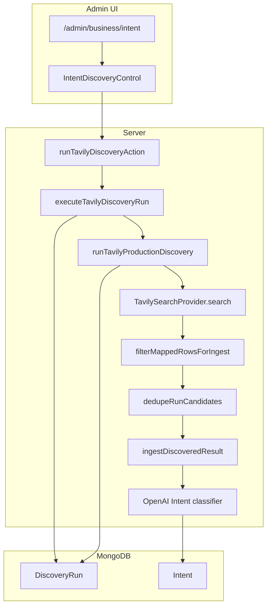

# Weblio Business — Phase 7.0: Discovery Automation & Credit Budget Audit

**Status:** Audit / design only (no implementation in this phase)  
**Scope:** Existing Intent Monitor manual Tavily discovery (W1–W7 production profiles)  
**Out of scope:** Phase 5 Business Discovery (deferred), profile redesign, catalog expansion, cron, email, cleanup code

---

## Executive summary

Production discovery today runs **7 Tavily Search API requests** per full run (one per W1–W7 profile), with **`search_depth: basic`** and **`max_results: 5`**. Under [current Tavily credit rules](https://docs.tavily.com/documentation/api-credits), each basic search costs **1 API credit** per successful request (not per result row). A single daily automated run therefore consumes about **7 credits/day (~196–217/month)**, far below the business target of **~900 credits/month** from a **1,000** monthly allowance.

Reaching **~850–900 automated credits/month** in **one daily cycle** requires a **future** increase to roughly **28–30 Tavily requests per day** via **query rotation / expanded catalog**—not repeating identical W1–W7 queries four times. That expansion is **explicitly deferred**; this audit documents the path but does not change profiles or catalog.

**Recommended automation architecture:** Reuse [`executeTavilyDiscoveryRun`](weblio/src/lib/business/discovery/execute-tavily-discovery-run.ts) from a protected Vercel Cron route; add internal monthly credit ledger (Tavily balance API is not integrated); morning email via existing Resend stack; weekly hard-delete cleanup for eligible raw Intents only.

**Recommended implementation order:** **7B** (scheduled discovery + credit guard) → **7A** (overview) → **7C** (email + cleanup) → **7D** (feedback) → **7E** (QA / optional cap expansion).

---

## 1. Current discovery pipeline

End-to-end flow from admin UI to persistence:



### Stage reference (files)

| Stage | Responsibility | Primary file(s) |
|-------|----------------|-----------------|
| UI trigger | Button “חפש הזדמנויות חדשות”, loading state, Hebrew result messages | [`IntentDiscoveryControl.tsx`](weblio/src/components/admin/business/intents/IntentDiscoveryControl.tsx) |
| Page bootstrap | Latest run hint for cooldown display | [`intent/page.tsx`](weblio/src/app/admin/(protected)/business/intent/page.tsx), `findLatestDiscoveryRunForCooldown` |
| Server action | `requireAdmin()`, revalidate intent + business paths | [`actions.ts`](weblio/src/lib/business/discovery/actions.ts) `runTavilyDiscoveryAction` |
| Orchestration | Enable flag, stale run recovery, active run guard, cooldown, create/complete/fail `DiscoveryRun` | [`execute-tavily-discovery-run.ts`](weblio/src/lib/business/discovery/execute-tavily-discovery-run.ts) |
| Profile selection | First N profiles from production catalog capped by policy | [`run-tavily-discovery.ts`](weblio/src/lib/discovery/run-tavily-discovery.ts) `resolveProfilesForRun` |
| Production catalog | W1–W7 JSON | [`search-profiles.he.prod.json`](weblio/config/discovery/search-profiles.he.prod.json), [`load-search-profiles.ts`](weblio/src/lib/discovery/providers/load-search-profiles.ts) |
| Policy | Limits, Tavily options | [`discovery-policy.ts`](weblio/src/lib/discovery/discovery-policy.ts) `PRODUCTION_DISCOVERY_POLICY` |
| Tavily HTTP | POST `/search`, map results, optional retry | [`tavily-search-provider.ts`](weblio/src/lib/discovery/providers/tavily-search-provider.ts) |
| Normalization | URL, content, provenance metadata | [`tavily-map.ts`](weblio/src/lib/discovery/providers/tavily-map.ts) |
| Pre-ingest filter | Mapping/validation/excluded domain | [`pre-ingest-filter.ts`](weblio/src/lib/discovery/pre-ingest-filter.ts) |
| In-run dedupe | Same persist key within run | [`dedupe-run-candidates.ts`](weblio/src/lib/discovery/dedupe-run-candidates.ts) |
| Candidate cap | Max unique candidates per run | `run-tavily-discovery.ts` (slice to `maxCandidatesPerRun`) |
| Ingest + classify | Upsert Intent, cap classifications | [`ingest.ts`](weblio/src/lib/discovery/ingest.ts), [`run-tavily-discovery.ts`](weblio/src/lib/discovery/run-tavily-discovery.ts) `ingestCandidatesWithClassificationCap` |
| Classifier | OpenAI when enabled | [`get-intent-classifier.ts`](weblio/src/lib/discovery/classifier/get-intent-classifier.ts), [`openai-env.ts`](weblio/src/lib/discovery/classifier/openai-env.ts) |
| Cross-run dedupe | Mongo upsert on `dedupeKey` | [`intents.ts`](weblio/src/lib/data/intents.ts) `upsertDiscoveredIntent` |
| Run persistence | Status, summary, profile metrics | [`discovery-runs.ts`](weblio/src/lib/data/discovery-runs.ts), [`DiscoveryRun` model](weblio/src/models/DiscoveryRun.ts) |
| Run status | completed / partial / failed | [`discovery-run-status.ts`](weblio/src/lib/discovery/discovery-run-status.ts) |
| Feature flag | Tavily discovery on server | [`discovery-env.ts`](weblio/src/lib/discovery/discovery-env.ts) `DISCOVERY_TAVILY_ENABLED=1` |

### Guards already in orchestration

- **Disabled:** `DISCOVERY_TAVILY_ENABLED` not `"1"`.
- **Already running:** `findActiveDiscoveryRun` unless stale (> **30 minutes**, `DISCOVERY_RUN_STALE_AFTER_MS`).
- **Cooldown:** **15 minutes** after last completed run (`runCooldownMinutes` in policy).
- **Missing Tavily key:** fail run with `provider_unavailable`.

Manual and scheduled discovery should share **`executeTavilyDiscoveryRun`** (or a thin wrapper); scheduled runs will need a defined **`triggeredBy`** value (e.g. `cron:daily`) and a policy decision on **cooldown bypass** for cron-only invocations.

---

## 2. W1–W7 production profiles

Source: [`config/discovery/search-profiles.he.prod.json`](weblio/config/discovery/search-profiles.he.prod.json)  
Shared Tavily options: [`PRODUCTION_DISCOVERY_POLICY`](weblio/src/lib/discovery/discovery-policy.ts)

| ID | Category | Query (Hebrew) | Purpose (from notes) |
|----|----------|----------------|----------------------|
| **W1** | `explicit_website` | מחפש מישהו שיבנה לי אתר לעסק | Conversational first-person demand for a business website |
| **W2** | `explicit_ecommerce` | מחפש מישהו שיבנה לי חנות Shopify | Explicit Shopify / ecommerce hiring demand |
| **W3** | `explicit_recommendation` | מחפש המלצה על בונה אתרים לעסק | Buyer seeking provider recommendation |
| **W4** | `explicit_quote` | מחפש הצעת מחיר לבניית אתר לעסק | Commercial buyer seeking website build quote |
| **W5** | `explicit_landing_page` | מחפש מישהו שיבנה לי דף נחיתה לעסק | Explicit landing-page demand |
| **W6** | `explicit_redesign` | האתר שלנו מיושן מחפשים מישהו שיעצב אותו מחדש | Outdated site, seeking redesign (plural “אנחנו”) |
| **W7** | `explicit_ecommerce` | צריך מישהו שיבנה לי חנות אינטרנטית לעסק | Alternate natural-language ecommerce phrasing |

### Per-profile Tavily parameters (all profiles)

| Parameter | Value |
|-----------|--------|
| Tavily calls per profile per run | **1** |
| `search_depth` | **`basic`** |
| `max_results` | **5** |
| `time_range` | **`week`** |
| `exclude_domains` | `youtube.com`, `www.youtube.com`, `youtu.be` |
| `include_answer` | **false** |
| `include_raw_content` | **false** |
| `auto_parameters` | **false** |
| Topic/category API fields | **Not used** in current request body |

### Aggregate / social profiles

W1–W7 are **keyword-style demand queries**, not dedicated “Facebook aggregate” search profiles. Aggregate/social **content** is handled at **ingest** via [`discovery-content-quality.ts`](weblio/src/lib/discovery/discovery-content-quality.ts) (e.g. skip auto-classification for `aggregated_social` on Facebook sources).

### Profile quality statistics (existing)

Each completed run can store **`profileSummaries`** on `DiscoveryRun` with per-profile counts: `raw`, `afterFilter`, `uniqueAttributed`, `created`, `rediscovered`, `classified`, `explicitNeed`, `possibleNeed`, `irrelevant`, `unclassified`, `errors` ([`discovery-profile-metrics.ts`](weblio/src/lib/discovery/discovery-profile-metrics.ts), [`types/discovery-run.ts`](weblio/src/types/discovery-run.ts)).

There is **no** long-term dashboard aggregating “W3 vs W1 yield” in the codebase. Operational review should use stored run history or export `profileSummaries` until 7A/7E reporting exists.

**Audit stance:** Do **not** redesign W1–W7 or expand catalog in Phase 7.0.

---

## 3. Tavily usage per discovery run

### A. API request count

| Item | Count |
|------|-------|
| Production profiles in catalog | 7 |
| `maxProfilesPerRun` | 7 |
| `maxTavilyRequestsPerRun` | 7 |
| **Tavily POST `/search` per full run** | **7** (one loop iteration per profile in [`run-tavily-discovery.ts`](weblio/src/lib/discovery/run-tavily-discovery.ts)) |

Each profile failure still increments `summary.tavilyRequests` (request was attempted). Provider returns error in-band (no throw) for HTTP failures except retry path.

### B. Retries (additional requests)

[`fetchTavilySearchResults`](weblio/src/lib/discovery/providers/tavily-search-provider.ts):

- Up to **2 attempts** per profile search.
- Retry only on HTTP **429** or **503**, with **1.5s** delay.
- **Worst case:** 7 profiles × 2 attempts = **14 HTTP requests** (if every profile hits retry once).

Retries **can consume additional Tavily credits** if Tavily bills per attempt (treat as risk; ledger should count successful or attempted requests explicitly in 7B).

### C. Features that do not add requests in current code

- No Tavily Extract/Crawl in production Intent path.
- No `include_raw_content` / `include_answer` in production search body.

---

## 4. Tavily credit rules (verification)

### What the repository assumes

The codebase does **not** embed Tavily pricing. Production uses **`search_depth: "basic"`** only.

### External reference (must stay aligned with live Tavily docs)

Per [Tavily Credits & Pricing](https://docs.tavily.com/documentation/api-credits) and [Search API `search_depth`](https://docs.tavily.com/documentation/api-reference/endpoint/search) (as of audit date):

| `search_depth` | Credits per search request (documented) |
|----------------|----------------------------------------|
| `basic`, `fast`, `ultra-fast` | **1** |
| `advanced` | **2** |

**`max_results` does not change credit cost** in Tavily’s documented model (cost is per request by depth).

### Pre-implementation checklist

1. Confirm plan tier (**1,000 credits/month** on Researcher/free tier per Tavily marketing docs).
2. Confirm billing month reset (Tavily states reset on **1st of calendar month**).
3. Confirm whether **failed requests** or **retries** consume credits on the account (not represented in repo — verify in Tavily dashboard/docs).
4. Do **not** hardcode dollar amounts in application logic.

### Expected credit cost per full run (current config)

| Scenario | Estimated credits |
|----------|-------------------|
| Normal full run (7 successful basic searches) | **7** |
| Worst-case retries (14 successful attempts) | **14** |
| Single profile error after one attempt | Still **1** credit for that profile if Tavily charges per request |

---

## 5. Monthly budget target

### Business requirements

| Concept | Target |
|---------|--------|
| Monthly allowance | **1,000** credits |
| Desired automated usage | **~900** (range **850–900** acceptable) |
| Reserve | **~100** buffer |

### Important: current run size vs target

**One daily run of today’s W1–W7 ≈ 7 credits/day**, not 30.

| Month length | Credits if 1× daily W1–W7 (7/day) |
|--------------|-----------------------------------|
| 28 days | **196** |
| 29 days | **203** |
| 30 days | **210** |
| 31 days | **217** |

So **~900/month is not achievable** with current profile count without **future** multi-request daily design (~**28–30** searches/day).

### Recommended budget layers (design)

| Layer | Purpose | Suggested value |
|-------|---------|-----------------|
| **Monthly automated target** | Planning / alerting | **850–900** |
| **Monthly automated hard stop** | Stop cron | **900–950** (internal estimate) |
| **Emergency reserve** | Avoid plan hard stop at 1000 | **50–100** |
| **Manual reserve** | Omer manual runs | **50–100** credits/month within the 1000 cap |

Internal ledger: sum **`DiscoveryRun.summary.tavilyRequests`** (or explicit `estimatedCredits`) for runs where `triggeredBy` matches automation prefix, per calendar month (align timezone with Tavily reset — use **UTC month** or **Asia/Jerusalem** consistently in 7B spec).

Account for **retries**, **manual runs**, and **partial runs** (requests still counted).

---

## 6. Searches per day — options

Assumption: **1 credit per basic search** (Section 4).

| Option | Tavily searches/day | Credits/day | 30-day month | 31-day month | Intent |
|--------|---------------------|-------------|--------------|--------------|--------|
| **Conservative (MVP)** | **7** (W1–W7 once) | 7 | **210** | **217** | Prove automation; large unused budget |
| **Target (~900/month)** | **~30** | ~30 | **~900** | **~930** | Needs **future catalog/policy** (rotation), not duplicate W1–W7 |
| **Aggressive** | 40+ | 40+ | 1200+ | — | **Reject** — exceeds 1000 plan |

### Recommended production configuration (phased)

**Stage 1 (7B MVP — no catalog change):**

- **1 cron invocation/day**
- **7 searches** (all W1–W7)
- **~210 credits/month** automated
- Remaining budget available for **manual discovery** and experiments

**Stage 2 (after deliberate catalog rotation design — not Phase 7.0):**

- **1 cron invocation/day**
- **~28–30 searches** via **rotating query sets** (e.g. 7 core + 21 variants on a 4-day cycle within one orchestrated run)
- Target **850–900 credits/month**
- **Co-review** `maxCandidatesPerRun` (**35**) and `maxClassificationsPerRun` (**20**)

**Principle:** Optimize **relevant Intent / credit**, not raw credit burn. Avoid identical queries repeated same day only to hit 900.

---

## 7. Profile rotation

### Current architecture

- Catalog order W1→W7; `resolveProfilesForRun` takes `slice(0, cap)`.
- All seven run every manual full discovery today.

### Recommendations

| Phase | Rotation |
|-------|----------|
| **Stage 1** | **All W1–W7 every day** — low credit cost, diverse angles, `time_range: week` limits stale overlap |
| **Stage 2** | **High-yield profiles daily** (likely W1, W2, W4, W5, W7) + **secondary queries on rotation** (gender/phrasing variants — PoC2 is reference only, not production copy) |
| **Avoid** | Running the **same seven queries multiple times per day** without new query text |

No rotation implementation in Phase 7.0.

---

## 8. Results per search (`max_results`)

| Question | Finding |
|----------|---------|
| More results → more Tavily credits? | **No** (per Tavily docs — per request by depth) |
| More results → more OpenAI? | **Only up to caps** — max **35** candidates ingested, **20** classifications per run |
| More noise / duplicates? | **Yes** — more rows per profile before in-run dedupe |

**Recommendation:** Keep **`max_results: 5`** for Stage 1 and until `profileSummaries` justify change. Raising to 10 without raising classification cap mostly fills the **35 candidate queue** with lower marginal value.

---

## 9. OpenAI classifier impact

| Setting | Value |
|---------|--------|
| Enable flag | `OPENAI_INTENT_CLASSIFICATION_ENABLED=1` |
| Default model | `gpt-5.4-nano` ([`openai-env.ts`](weblio/src/lib/discovery/classifier/openai-env.ts)) |
| Timeout | `OPENAI_INTENT_TIMEOUT_MS` (default **20s**) |
| Max classifications / run | **20** |
| Max candidates / run | **35** |
| Skip classification | `aggregated_social` content quality ([`ingest.ts`](weblio/src/lib/discovery/ingest.ts)) |

### Scaling Tavily without cap changes

Example: **30 Tavily requests/day** × 5 results = up to **150 raw rows**/day, but pipeline still ingests at most **35** and classifies **20**. Extra searches **do not linearly increase** OpenAI cost unless policy caps increase.

### Duplicate filtering

- In-run URL dedupe before ingest.
- Cross-run: existing Intent updated (`rediscovered`), not re-classified if already classified (classifier runs on unclassified per ingest rules).

**Operational impact:** Daily automation at Stage 1 ≈ **≤20 OpenAI calls/day** (often fewer due to filters, skips, duplicates).

---

## 10. Daily automation design (future)

Conceptual flow (reuse existing orchestration):

```
Vercel Cron (UTC)
  → POST /api/cron/discovery (protected)
  → acquire guard (active run / monthly credit / feature flags)
  → executeTavilyDiscoveryRun({ triggeredBy: "cron:daily", ... })
       → createDiscoveryRunRunning
       → runTavilyProductionDiscovery
       → completeDiscoveryRun | failDiscoveryRun
  → (7C) queue morning email from DiscoveryRun summary
```

**Do not** fork a second discovery implementation.

### Cron-specific design notes

- **`triggeredBy`:** distinguish `cron:daily` from admin email for ledger and support.
- **Cooldown:** 15-minute cooldown blocks back-to-back **manual** runs; daily cron should **bypass cooldown** or use `findLatestForCooldown` only for manual path.
- **Idempotency:** Active `running` run blocks overlap; stale run marked failed after 30 minutes.

---

## 11. Run time (Israel)

**Goal:** Scan complete before Omer’s morning; email shortly after.

| Event | Recommended local time (Asia/Jerusalem) |
|-------|-------------------------------------------|
| Discovery start | **02:30** |
| Expected completion | ~02:35–02:45 (7 searches; allow headroom for 30-search Stage 2) |
| Morning email | **07:00** (separate cron or delayed job if run duration grows) |

### UTC mapping (Vercel Cron uses UTC)

| Israel offset | 02:30 IL → UTC |
|---------------|----------------|
| IST (UTC+2, winter) | **00:30 UTC** same calendar date |
| IDT (UTC+3, summer) | **23:30 UTC** previous calendar date |

**Recommendation:** One **daily** discovery cron, not hourly polling.

**Risk:** Stage 2 with ~30 sequential searches + up to 20 classifications may approach **Vercel serverless maxDuration** — measure in 7B and consider `maxDuration` config or batching.

---

## 12. Morning email design (future)

### Existing infrastructure

| Piece | Location |
|-------|----------|
| Resend client | [`resend.ts`](weblio/src/lib/email/resend.ts) — `RESEND_API_KEY` |
| Send patterns | [`lead-emails.ts`](weblio/src/lib/email/lead-emails.ts) — HTML RTL, attachments optional |
| Owner notification precedent | `LEAD_NOTIFICATION_EMAIL` |

### Template variants

**A. Successful run with results**

- Greeting: «בוקר טוב עומר»
- Scan **completed** (or **partial** — see C)
- **`created`** new intents (from `DiscoveryRun.summary`)
- **Actionable / quality:** count of new **`explicitNeed` + `possibleNeed`** if derivable from summary/profileSummaries; else **`classified`** and link to Intent Monitor
- Link: `/admin/business/intent`, `/admin/business`
- **Do not** list every result in email

**B. Successful run with zero new intents**

- Confirm scan **ran successfully**
- «לא נוספו כוונות חדשות» (distinct from failure)

**C. Failed or partial run**

- **Partial:** «הסריקה הושלמה חלקית» + `profileErrorCount` / profile errors summary
- **Failed:** «הסריקה נכשלה» — automation problem, **not** “no opportunities”
- Link to Intent Monitor / future overview error state

### Email failure

Log and optionally retry; **do not** fail discovery run if email send fails.

---

## 13. Should email send every day?

**Recommendation: Yes** for **scheduled** runs.

| Approach | Pros | Cons |
|----------|------|------|
| Always send | Confirms automation heartbeat; surfaces failures | More inbox noise |
| Only when results | Quieter | Silent failures look like “nothing found” |

Aligns with stated preference: **always send concise status** after scheduled completion.

---

## 14. Weekly Intent cleanup (design)

**Today:** No `deleteIntent` / cleanup in codebase — **new** 7C work.

### Intent schema ([`types/intent.ts`](weblio/src/types/intent.ts))

| Field | Values / meaning |
|-------|------------------|
| `classification` | `unclassified`, `explicitNeed`, `possibleNeed`, `irrelevant` |
| `status` | `new`, `dismissed`, `saved` |
| `opportunityId` / `convertedAt` | Linked to Opportunity workflow |
| `discoveryCount`, `lastSeenAt` | Rediscovery metadata |

User actions: dismiss, save (terminal), convert to Opportunity (sets opportunity link / saved path).

### Deletion policy (recommended)

| Record | Action |
|--------|--------|
| Has `opportunityId` or `convertedAt` | **Never delete** |
| `status: saved` | **Never delete** |
| `classification: irrelevant` AND `status: new` AND no opportunity | **Eligible** after retention |
| `status: dismissed` AND no opportunity | **Eligible** after retention |
| `explicitNeed` / `possibleNeed` AND `status: new` | **Keep** until user dismisses or converts |
| `unclassified` | **Do not auto-delete in V1** (may still be reviewed) |

### Retention anchor

Use **`lastSeenAt`** (updated on rediscovery) rather than only `discoveredAt`, so briefly rediscovered noise is not deleted prematurely.

**Recommended retention:** **14 days** (configurable via env name in Section 20).

### Hard delete vs archive

**Recommend hard delete** for eligible raw discovery rows only. Keep **`DiscoveryRun`** documents for audit and credit ledger. No archive collection exists today; avoid unbounded “soft archive” unless product requires history.

---

## 15. Irrelevant results and feedback (7D precursor)

| Signal | Cleanup implication |
|--------|---------------------|
| Classifier `irrelevant` | Primary auto-cleanup cohort after retention |
| User `dismissed` | Eligible after retention |
| User `saved` / converted | **Protected** |
| `unclassified` | Protected in V1 cleanup |

Phase **7D feedback loop** is not part of 7.0; future signals may refine eligibility.

---

## 16. Weekly cleanup schedule

| Job | Suggested time (Asia/Jerusalem) | Rationale |
|-----|----------------------------------|-----------|
| Daily discovery | **02:30** | Fresh intents before business day |
| Weekly cleanup | **Sunday 01:00** | Before Monday week; separate cron for clarity |

Order: cleanup **before** Monday discovery is acceptable (removes stale noise first). Avoid coupling cleanup inside discovery run (separate failure domains).

---

## 17. Duplicate prevention audit

| Layer | Mechanism | File |
|-------|-----------|------|
| URL normalization | HTTPS normalize | [`normalize-url.ts`](weblio/src/lib/discovery/normalize-url.ts) |
| Persist identity | `dedupeKey`: `provider+externalId` or `url:sha256` | [`dedupe-key.ts`](weblio/src/lib/discovery/dedupe-key.ts) |
| Tavily mapping | URL-first; omit `externalId` when HTTPS URL present | [`tavily-map.ts`](weblio/src/lib/discovery/providers/tavily-map.ts) |
| Within run | `dedupeRunCandidates` | [`dedupe-run-candidates.ts`](weblio/src/lib/discovery/dedupe-run-candidates.ts) |
| Cross run | `upsertDiscoveredIntent` → `rediscovered`, bump `lastSeenAt` | [`intents.ts`](weblio/src/lib/data/intents.ts) |
| Profile attribution | First-wins in profile metrics | [`discovery-profile-metrics.ts`](weblio/src/lib/discovery/discovery-profile-metrics.ts) |

### Sufficiency for daily runs

**Adequate for Stage 1** with `time_range: week` — same URL often **rediscovered** rather than duplicated. Residual risks: URL variants, truncated Facebook URLs, title-only content — document for 7E monitoring; no mandatory dedupe change before Stage 1 automation.

---

## 18. Failure and retry strategy (design)

| Failure | Behavior (current / recommended) |
|---------|----------------------------------|
| Tavily per-profile error | Run continues; `profileErrors`; status **partial** if any errors ([`discovery-run-status.ts`](weblio/src/lib/discovery/discovery-run-status.ts)) |
| Tavily 429/503 | One retry → **extra credit risk** |
| OpenAI failure | Intent remains **unclassified**; ingest succeeds |
| Classifier timeout | Same as failure — unclassified |
| Mongo create/complete fail | Blocked/failed result to caller |
| Partial profiles | **partial** run status; still email (variant C) |
| Email failure | Log; discovery success unchanged |
| Cron double fire | **already_running** or stale recovery |
| Long-running overlap | Stale after **30 min** → mark failed, allow new run |

**Retries:** Do not add blind multi-retry loops on Tavily without credit guard awareness.

**DiscoveryRun should record:** existing summary fields, `failureCategory`, `triggeredBy`, optional `estimatedCredits`, profile summaries.

---

## 19. Credit guard (design)

| Question | Answer |
|----------|--------|
| Tavily remaining credits API in repo? | **No** |
| Approach | **Internal monthly estimate** from completed automation runs |

Suggested logic (7B):

1. On cron entry, sum credits for month where `triggeredBy` starts with `cron:` (estimate = sum of `tavilyRequests × 1` for basic, or stored field).
2. If sum ≥ **`DISCOVERY_MONTHLY_CREDIT_LIMIT`** (e.g. 900): skip run, record skipped run or alert email.
3. If sum ≥ hard stop (950–1000): skip + warn.

**Manual discovery when cap reached:**

- **Recommend:** Allow manual with **explicit UI warning** and optional **`DISCOVERY_MANUAL_ALLOWED_WHEN_CAP_REACHED=0`** to block manual too near plan limit.

---

## 20. Configuration (env variable names only)

| Variable | Purpose |
|----------|---------|
| `DISCOVERY_TAVILY_ENABLED` | Existing — server Tavily discovery |
| `TAVILY_API_KEY` | Existing — Tavily auth |
| `OPENAI_INTENT_CLASSIFICATION_ENABLED` | Existing |
| `OPENAI_API_KEY` | Existing |
| `OPENAI_INTENT_MODEL` | Existing |
| `OPENAI_INTENT_TIMEOUT_MS` | Existing |
| `DISCOVERY_AUTOMATION_ENABLED` | Master switch for cron automation |
| `DISCOVERY_CRON_SECRET` | Protect cron routes (or Vercel `CRON_SECRET`) |
| `DISCOVERY_DAILY_MAX_TAVILY_REQUESTS` | Cap requests per automated run (Stage 1: 7) |
| `DISCOVERY_MONTHLY_CREDIT_LIMIT` | Soft stop (~900) |
| `DISCOVERY_MONTHLY_CREDIT_HARD_STOP` | Hard stop (~950–1000) |
| `DISCOVERY_MANUAL_ALLOWED_WHEN_CAP_REACHED` | Manual override near cap |
| `DISCOVERY_MORNING_EMAIL_ENABLED` | Email switch |
| `DISCOVERY_NOTIFICATION_EMAIL` | Recipient (or document reuse of `LEAD_NOTIFICATION_EMAIL`) |
| `DISCOVERY_CLEANUP_ENABLED` | Weekly cleanup switch |
| `DISCOVERY_CLEANUP_RETENTION_DAYS` | Default **14** |
| `RESEND_API_KEY` | Existing |

No secret values in documentation.

---

## 21. Vercel Cron architecture (design)

| Topic | Recommendation |
|-------|----------------|
| Config | Add `vercel.json` crons in **7B** (not 7.0) |
| Route | e.g. `app/api/cron/discovery/route.ts` |
| Auth | Verify `Authorization: Bearer ${DISCOVERY_CRON_SECRET}` or platform header |
| Production only | Skip or no-op in preview/dev unless explicitly enabled |
| Duplicate invocation | Rely on `findActiveDiscoveryRun` + stale handling |
| Logging | `runId`, status, `tavilyRequests`, duration — no API keys |
| Timeout | Monitor; set `maxDuration` if needed for Stage 2 |

No `vercel.json` exists in repo at audit time.

---

## 22. Phase 7A — Business Overview integration

Current overview ([`business/page.tsx`](weblio/src/app/admin/(protected)/business/page.tsx), [`overview-data.ts`](weblio/src/lib/business/overview-data.ts)) shows follow-ups, leads, **`actionableIntentsCount`**, opportunities — **no discovery run status**.

### Recommended 7A additions (read-only)

| UI element | Data source |
|------------|-------------|
| Last discovery completed at | Latest `DiscoveryRun.completedAt` (filter automation optional) |
| Last run status | `completed` / `partial` / `failed` |
| New intents last run | `summary.created` |
| Classified last run | `summary.classified` |
| Actionable inbox | Existing `countActionableIntents()` |
| Automation warning | Last cron run failed/partial or monthly cap near limit |
| Next scan | Cron schedule (static config text if reliable) |

Reuse Hebrew formatting patterns from [`discovery-run-messages.ts`](weblio/src/lib/business/discovery/discovery-run-messages.ts).

---

## 23. Intended production daily experience

### Stage 1 (current W1–W7, no catalog change)

| Time (IL) | Event |
|-----------|--------|
| **02:30** | Cron starts **one** discovery run → **7** Tavily searches → ingest/classify → `DiscoveryRun` completed |
| **~07:00** | Email: «בוקר טוב עומר» + summary + link |
| Morning | Omer opens **סקירה עסקית** → sees last run status + actionable intent count |
| Workflow | Intent Monitor → review → Opportunity |
| **Sunday 01:00** | Weekly cleanup removes eligible stale irrelevant/dismissed intents (**14d**) |

**Credits:** ~**7/day**, ~**210/month** automated — **~790** headroom on 1000 plan.

### Stage 2 (future — not Phase 7.0)

| Time (IL) | Event |
|-----------|--------|
| **02:30** | **~28–30** rotated searches in **one** run → target **850–900** credits/month |
| Same | Email + overview + cleanup |

---

## 24. Phase 7 implementation order (recommended)

| Order | Phase | Deliverable |
|-------|-------|-------------|
| **1** | **7B** | Vercel cron, cron auth, `executeTavilyDiscoveryRun` wrapper, credit ledger, cooldown bypass for cron |
| **2** | **7A** | Overview cards / last run / failure warning |
| **3** | **7C** | Morning email + weekly cleanup job + retention rules |
| **4** | **7D** | User feedback loop for cleanup quality |
| **5** | **7E** | E2E QA, duration tests, optional cap/catalog Stage 2 |

Rationale: 7A without scheduled runs adds little; **`DiscoveryRun` already exists** once 7B runs.

---

## Risks and open questions

1. **900/month vs 7/day mismatch** — Product must accept Stage 1 ~210/month **or** approve Stage 2 catalog rotation (separate design phase).
2. **Tavily retry billing** — Retries may double charge; verify with Tavily account.
3. **Vercel timeout** — Stage 2 may need `maxDuration` or split batches.
4. **Month boundary** — Align internal ledger with Tavily reset (1st of month UTC vs IL).
5. **Unclassified cleanup** — Defer until policy clear; avoids deleting unreviewed leads.
6. **Cooldown vs cron** — Must implement cron bypass to avoid blocking daily schedule after manual run.
7. **Classifier cap** — Expanding Tavily without raising **20** classification cap limits value.

---

## Explicit Q&A

| # | Question | Answer |
|---|----------|--------|
| 1 | How many Tavily API requests does one current full discovery run make? | **7** (one per W1–W7) |
| 2 | How many Tavily credits should that consume? | **~7** at `basic` depth (up to **~14** if every profile retries once on 429/503) — confirm with [Tavily credits docs](https://docs.tavily.com/documentation/api-credits) |
| 3 | How many automated searches should run per day? | **Stage 1: 7**; **Stage 2 target: ~28–30** to approach 900/month |
| 4 | Credits in 28/29/30/31-day months at Stage 1 (7/day)? | **196 / 203 / 210 / 217** |
| 5 | Should all W1–W7 run every day? | **Yes** for Stage 1; Stage 2 adds **rotation**, not same-query repetition |
| 6 | How many results per search request? | **Keep 5** (`DEFAULT_TAVILY_MAX_RESULTS`) |
| 7 | How much budget for manual runs? | **~50–100 credits/month** within 1000 plan (policy choice) |
| 8 | When monthly automated budget reached? | **Stop automated cron**; manual per `DISCOVERY_MANUAL_ALLOWED_WHEN_CAP_REACHED` |
| 9 | What time should discovery run? | **Start ~02:30 Asia/Jerusalem** |
| 10 | Should Omer receive email every morning? | **Yes** after scheduled run (concise status) |
| 11 | What should the email contain? | Success/partial/failure distinction, key counts, links — not full result list |
| 12 | What if discovery fails? | Failed/partial run + email states **scan problem**, not “no results” |
| 13 | Which Intent records can be deleted weekly? | **irrelevant + new** or **dismissed**, no opportunity/saved, past retention |
| 14 | Retention 7, 14, or other? | **14 days** recommended (`lastSeenAt`) |
| 15 | Hard delete or archive? | **Hard delete** eligible raw intents; keep `DiscoveryRun` |
| 16 | Is current dedupe sufficient for daily runs? | **Yes for Stage 1**; monitor URL edge cases |
| 17 | Can existing orchestration be reused? | **Yes** — `executeTavilyDiscoveryRun` + `runTavilyProductionDiscovery` |
| 18 | What should Business Overview show? | Last run, status, counts, cap warning, link to Intent Monitor |
| 19 | Revised Phase 7 sub-phase order? | **7B → 7A → 7C → 7D → 7E** |

---

## Related documents

- Phase 6 AI Marketing final: [`webliobusiness-phase6-ai-marketing-final.md`](webliobusiness-phase6-ai-marketing-final.md)
- Production policy tests: [`search-profiles-catalog.test.ts`](weblio/tests/business/search-profiles-catalog.test.ts)

---

*End of Phase 7.0 audit — documentation only. No code, cron, email, cleanup, profile, or catalog changes in this phase.*
